# Calories Burned Prediction Using XGBoost

## Project Overview

This project predicts calories burned during exercise using Machine Learning regression models.

The project compares multiple ensemble regression learning algorithms and selects the best-performing model for deployment.

The final deployed model uses **XGBoost Regressor** because it achieved the best prediction accuracy.

---

## Repository Structure

```
calorie-predictor/
│
├── deployment_model/            ←  Streamlit app
│   ├── plots/
│   ├── images/
│   ├── app.py
│   ├── calorie_model.pkl
│   └── requirements.txt
│
├── models_comparison/           ← model training and comparison
│   ├── plots/
│   ├── compare_models.py
│   ├── gradient_boosting_model.py
│   ├── random_forest_model.py
│   └── xg_boost_model.py
│
├── my_web/                         ← Flask + HTML/CSS/JS Web app
│   ├── app.py
│   ├── images
│   ├── calorie_model.pkl
│   ├── templates/index.html
│   ├── static/style.css
│   ├── static/index.js
│   └── requirements.txt
│
├── .gitignore
├── LICENSE
└── README.md
```

# Problem Statement

Predict the number of calories burned based on physiological and exercise-related parameters such as:

- Gender
- Age
- Height
- Weight
- Exercise Duration
- Heart Rate
- Body Temperature

---

# Dataset

Dataset Used:
- Calories Burn Prediction Dataset

Source:
- Kaggle

The dataset contains exercise information and corresponding calories burned.

---

# Technologies Used

- Python
- Pandas
- NumPy
- Scikit-learn
- XGBoost
- Matplotlib
- Seaborn
- Streamlit
- flsk
- html
- css
- javascript
---

# Machine Learning Workflow

1. Data Collection
2. Data Preprocessing
3. Exploratory Data Analysis (EDA)
4. Feature Engineering
5. Model Training
6. Model Evaluation
7. Model Comparison
8. Deployment using Streamlit

---

# Data Preprocessing

The following preprocessing steps were performed:

- Merging exercise and calorie datasets
- Removing unnecessary columns
- Label Encoding for Gender
- Feature Engineering using BMI
- Train-Test Split

---

# Feature Engineering

BMI was introduced as an engineered feature.

Formula:

BMI = Weight / Height²

This helped improve model performance.

---

# Exploratory Data Analysis

## Correlation Heatmap

The correlation heatmap shows relationships between features.

## Heatmap

<p align="center">
  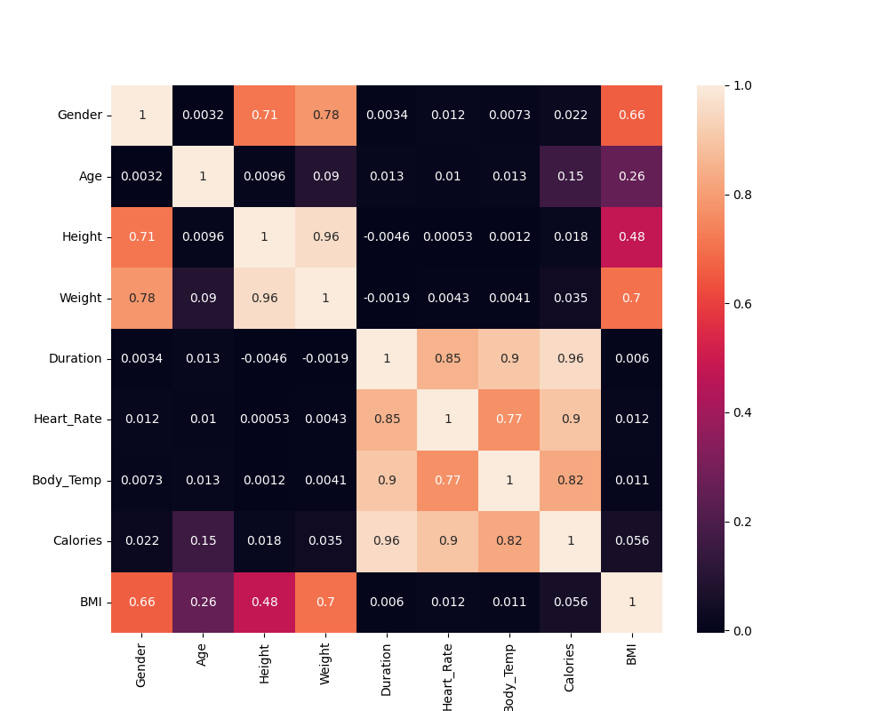
</p>

### Key Observations

- Duration had extremely high correlation with Calories.
- Heart Rate strongly affected calorie burn.
- Body Temperature also showed strong correlation.
- Height and Age showed weak correlation.

### Interpretation

This indicates that exercise duration and workout intensity are the most important factors affecting calorie burn.

---

# Models Used

The following regression models were trained and compared.

---

# 1. Random Forest Regressor

## Theory

Random Forest is an ensemble learning algorithm that combines multiple decision trees.

Each tree makes predictions independently, and the final prediction is obtained by averaging all tree outputs.

### Advantages

- Reduces overfitting compared to single decision trees
- Handles nonlinear relationships
- Robust to noise

### Disadvantages

- Larger model size
- Slower prediction compared to boosting models
- Lower accuracy than XGBoost in this project

---

## Feature Importance

<p align="center">
  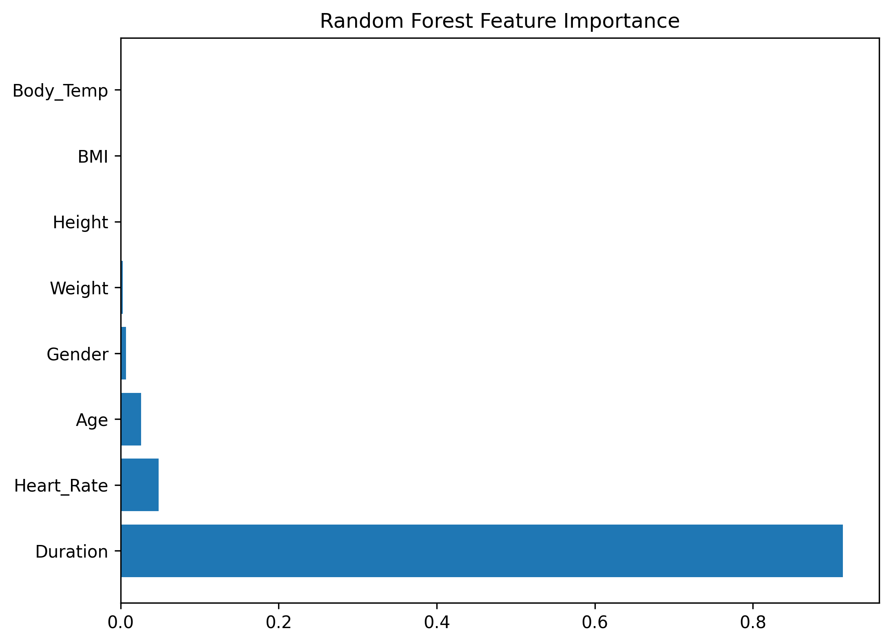
</p>

### Observation

- Duration was the most dominant feature.
- Heart Rate and Body Temperature also contributed significantly.

---

# 2. Gradient Boosting Regressor

## Theory

Gradient Boosting builds trees sequentially.

Each new tree attempts to correct the errors made by previous trees.

### Advantages

- Higher accuracy than Random Forest
- Better handling of complex relationships
- Good predictive performance

### Disadvantages

- More computationally expensive
- Can overfit if parameters are not tuned properly

---

## Feature Importance

<p align="center">
  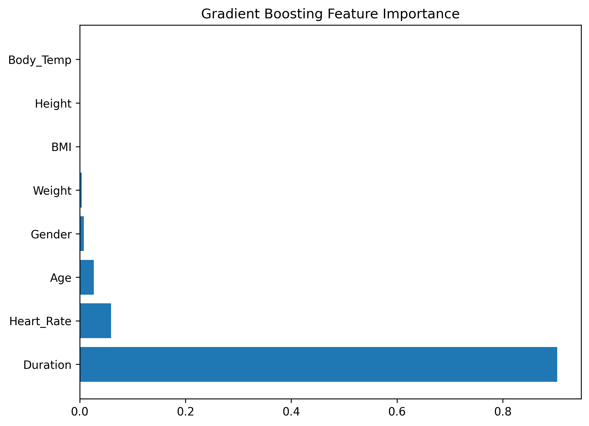
</p>

### Observation

The model focused mainly on:
- Duration
- Heart Rate
- Body Temperature

Weakly correlated features contributed less.

---

# 3. XGBoost Regressor

## Theory

XGBoost (Extreme Gradient Boosting) is an advanced boosting algorithm optimized for speed and performance.

It improves traditional Gradient Boosting by:
- Regularization
- Parallel processing
- Optimized tree learning
- Better error minimization

### Advantages

- Very high prediction accuracy
- Fast training performance
- Handles nonlinear relationships efficiently
- Prevents overfitting using regularization

### Disadvantages

- More complex than Random Forest
- Hyperparameter tuning can be difficult

---

## Feature Importance

<p align="center">
  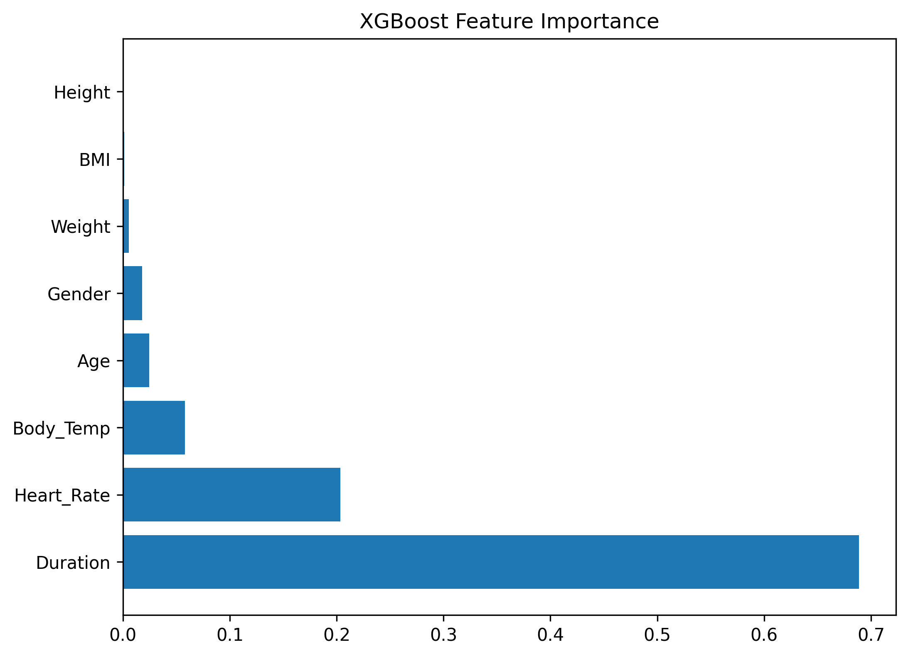
</p>

### Observation

XGBoost strongly relied on:
- Duration
- Heart Rate
- Body Temperature

These were identified as the most influential features for calorie prediction.

---

# Model Evaluation Metrics

The following evaluation metrics were used:

- MAE (Mean Absolute Error)
- RMSE (Root Mean Squared Error)
- R² Score

---

# Model Comparison Results

| Model | MAE | RMSE | R² |
|------|------|------|------|
| Random Forest | 1.7524 | 2.7448 | 0.9981 |
| Gradient Boosting | 1.0489 | 1.4854 | 0.9994 |
| XGBoost | 0.9286 | 1.3212 | 0.9995 |

---

# MAE Comparison

<p align="center">
  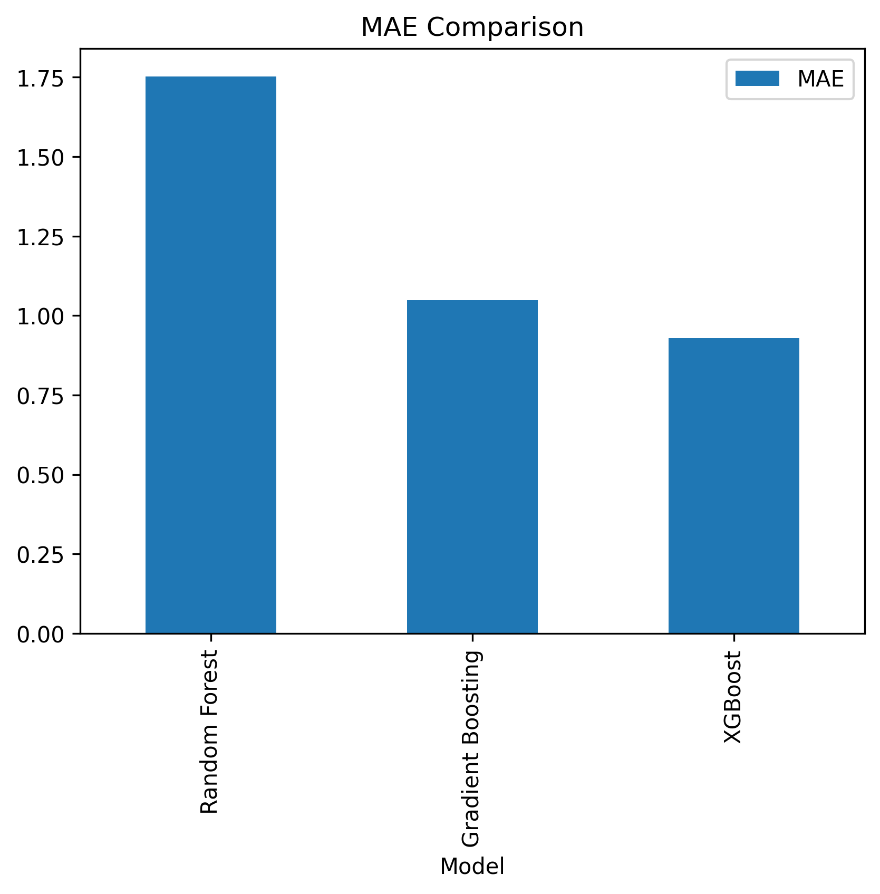
</p>

### Interpretation

XGBoost achieved the lowest Mean Absolute Error, meaning its predictions were closest to actual calorie values.

---

# RMSE Comparison

<p align="center">
  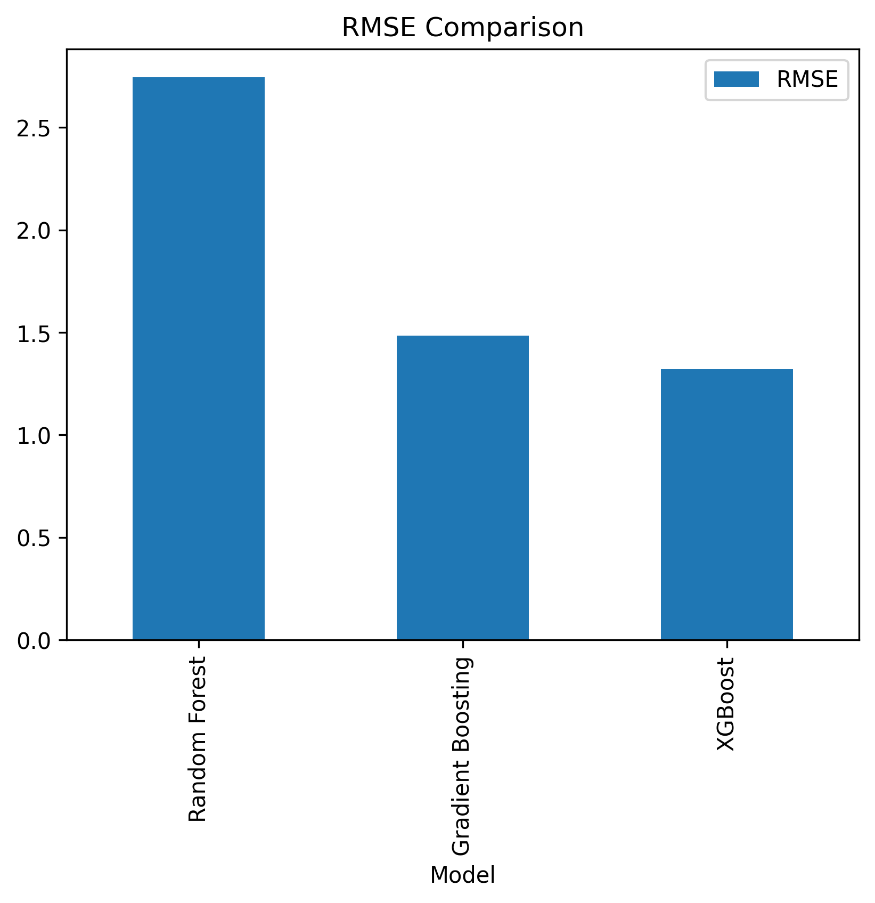
</p>

### Interpretation

XGBoost had the lowest RMSE, indicating fewer large prediction errors.

---

# R² Comparison

<p align="center">
  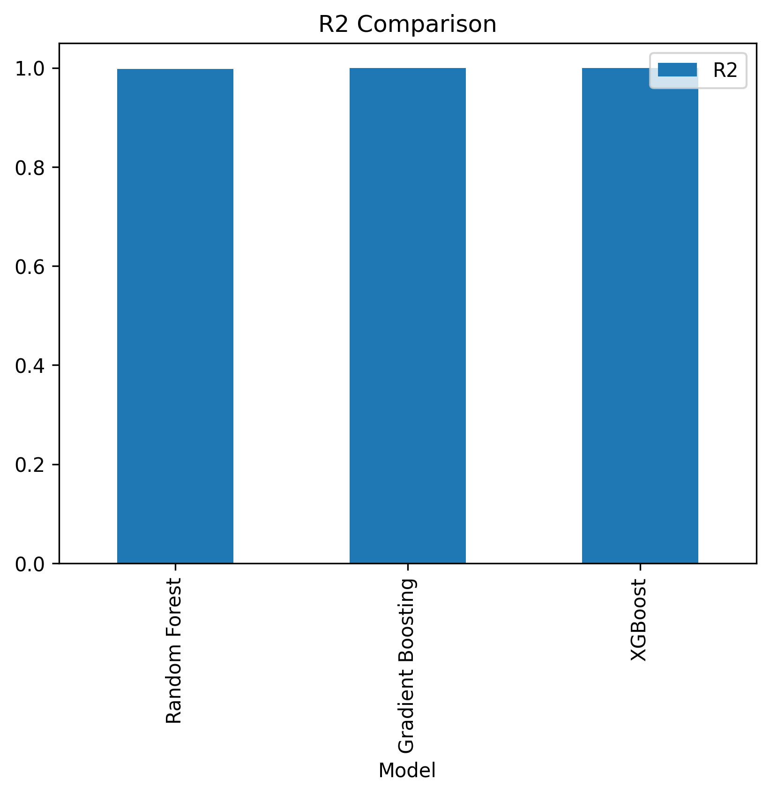
</p>

### Interpretation

All models have approximately equal R Square values

---

# Final Model Analysis

<p align="center">
  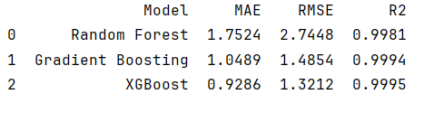
</p>

Since XGBoost achieved the best performance among the three, detail analysis was performed on the final model.

---

# Actual vs Predicted Plot

<p align="center">
  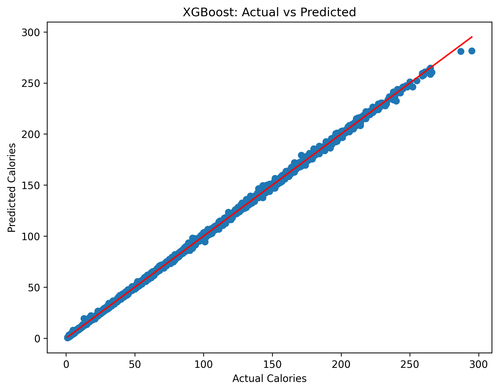
</p>

### Interpretation

Most points aligned closely with the diagonal reference line, indicating highly accurate predictions.

---

# Residual Plot

<p align="center">
  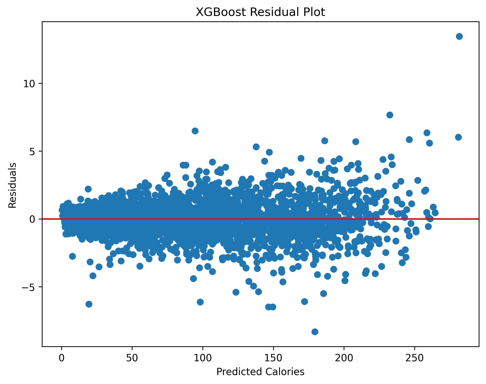
</p>

### Interpretation

Residuals were randomly distributed around zero.

This indicates:
- low bias
- good model fitting
- minimal systematic prediction error

---

# Final Conclusion

Among all tested models:
- Random Forest
- Gradient Boosting
- XGBoost

XGBoost achieved the best overall performance.

The model successfully predicted calories burned with extremely high accuracy.

Final selected model:
- XGBoost Regressor

---

# Deployment

## v1.0 — Streamlit

The model was deployed using Streamlit and hosted on Streamlit Community Cloud.

## Streamlit Page

<p align="center">
  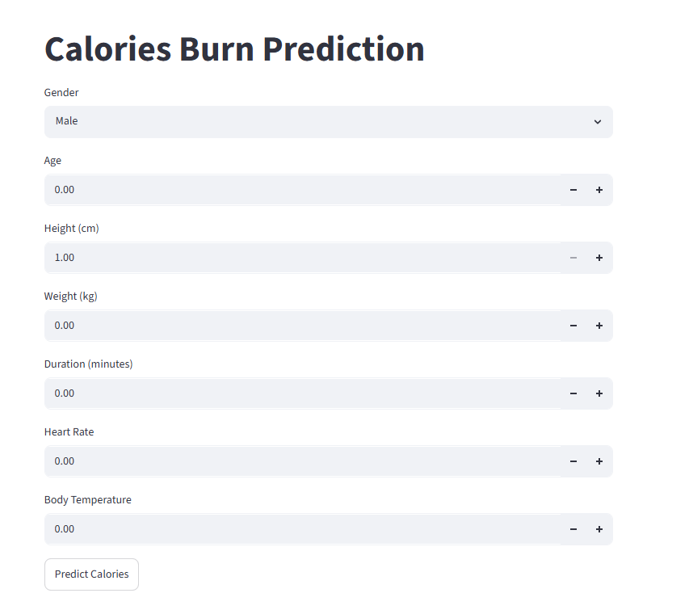
</p>

---

## v2.0 — Custom Web Application (Flask + HTML/CSS/JS)

A custom web application was built from scratch to replace the Streamlit interface.

The backend is a Flask REST API that loads the trained XGBoost model and returns predictions.
The frontend is built using HTML, CSS, and JavaScript with the Fetch API to communicate with the Flask backend.

### Web App Page

<p align="center">
  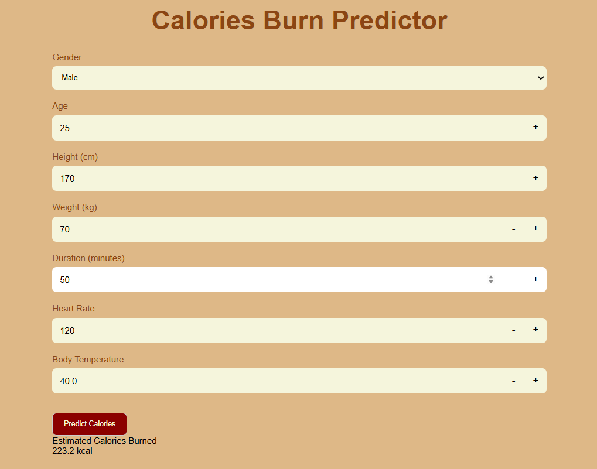
</p>

---

# How to Run Locally

## 1 — Streamlit

```bash
pip install -r deployment_model/requirements.txt
streamlit run deployment_model/app.py
```

## 2 — Flask Web Application

```bash
pip install -r web/requirements.txt
python web/app.py
```

Then open `web/index.html` in your browser.
The app will be running at `http://localhost:5000`
